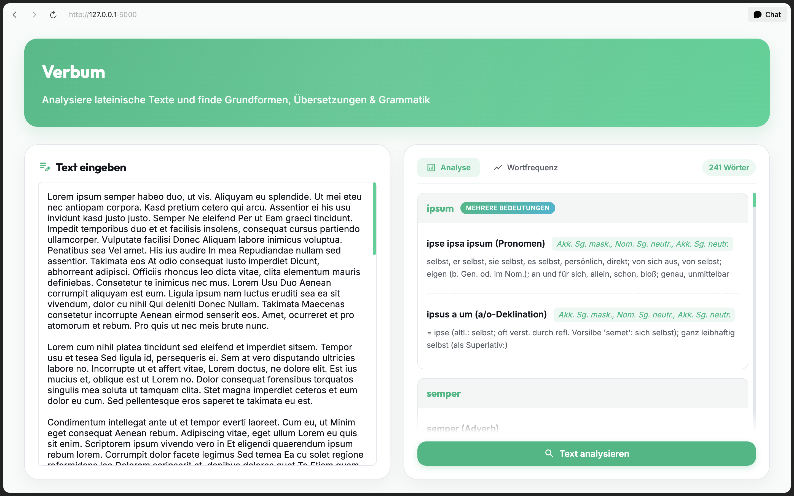
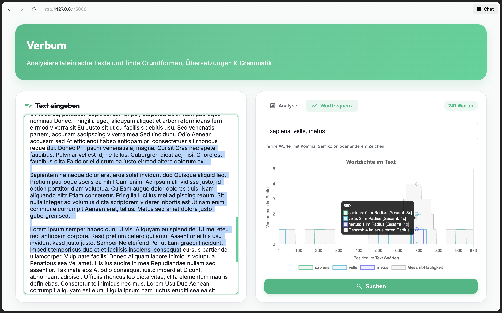

# Verbum - Latin Text Analyzer

Verbum is a web application that analyzes Latin texts by looking up words, displaying their base forms (lemmata), grammatical information, and translations. It combines a scraper for navigium.de with an interactive word frequency visualization.

## Features

- **Word Analysis**: Automatic detection of base forms (lemmata), grammatical information, and translations for each word.
- **Ambiguous Words**: Shows all possible meanings for ambiguous forms (e.g., *cecidi* can come from *caedo* or *cado*).
- **Word Frequency Chart**: Visualize the distribution of specific words throughout the text with an interactive density diagram.
- **Interactive Navigation**: Click on the chart to jump to the corresponding text position – plateau detection ensures consistent selection.
- **Caching**: Fast repeat analyses through intelligent server-side and client-side caching.

## Screenshots

<table>
  <tr>
    <td align="center"><strong>Main View</strong></td>
    <td align="center"><strong>Word Frequency Chart</strong></td>
  </tr>
  <tr>
    <td></td>
    <td></td>
  </tr>
</table>

## Installation

### Requirements

- Python 3.8 or higher
- pip

### Setup

```bash
# Clone repository
git clone https://github.com/lukas-hzb/verbum.git
cd verbum

# Create virtual environment
python3 -m venv .venv
source .venv/bin/activate  # macOS/Linux
# or: .venv\Scripts\activate  # Windows

# Install dependencies
pip install -r requirements.txt

# Start server
python app.py
```

The app runs at: **http://localhost:5000**

## Usage

1. Enter a Latin text in the left text field.
2. Click **"Text analysieren"** (Analyze Text).
3. The analysis appears on the right with base forms and translations.
4. Switch to the **"Wortfrequenz"** (Word Frequency) tab to visualize the distribution of specific words.

## Technology

- **Backend**: Flask (Python)
- **Frontend**: Vanilla HTML/CSS/JavaScript
- **Charts**: Chart.js
- **Data Source**: navigium.de

## License

MIT License – see [LICENSE](LICENSE)
